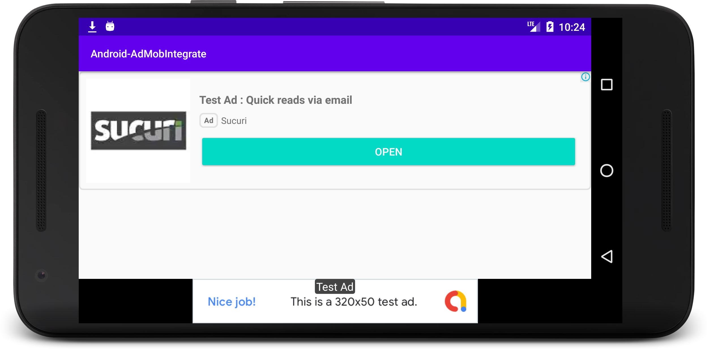

## Android Advertising Integrate

## Objective

Facilitate implementation of "Google AdMob" advertising in an Android Application.
- AdNative (Show custom template when no internet access)
- AdView Helper (Helper class that shows the appropriate size of AddView View on any device.)
- AdInterstitial Helper (Helper class that loads and displays Interstitial Ad)

## News


## Installation

Include library in your project.

```
build.gradle (project)

allprojects {
    repositories {
        ...
        maven { url 'https://jitpack.io' }
    }
}


build.gradle (:app)

dependencies {
    implementation fileTree(dir: 'libs', include: ['*.jar'])
    ...
    implementation 'com.github.arteaprogramar:Android-AdMobIntegrate:4.1.7'
    implementation 'com.google.android.gms:play-services-ads:22.6.0'
    ...
}

```

## Usage

- Update your AndroidManifest.xml
```
<manifest>
    <application>
        <!-- Sample AdMob App ID: ca-app-pub-3940256099942544~3347511713 -->
        <meta-data
            android:name="com.google.android.gms.ads.APPLICATION_ID"
            android:value="ca-app-pub-xxxxxxxxxxxxxxxx~yyyyyyyyyy"/>
    </application>
</manifest
```

- Initialize Mobile Ads SDK

```
Java Lambda
protected void onCreate(Bundle savedInstanceState) {
    super.onCreate(savedInstanceState);
    setContentView(...);

    MobileAds.initialize(this, initializationStatus -> { });

}

Kotlin
override fun onCreate(savedInstanceState: Bundle?) {
    super.onCreate(savedInstanceState)
    setContentView(R.layout.activity_main)

    MobileAds.initialize(this){}
}
```

### Create AdView Programmatically

activity_main.xml

```
<androidx.appcompat.widget.LinearLayoutCompat
    android:layout_width="match_parent"
    android:layout_height="wrap_content"
    android:layout_alignParentBottom="true"
    android:gravity="center_horizontal"
    android:id="@+id/adc"/>
```

MainActivity Class

```
// View Content
private LinearLayoutCompat mContent;

// AdView Helper
private AdViewHelper adViewHelper;

protected void onCreate(Bundle savedInstanceState) {
    ...
    mContent = findViewById(R.id.adc);
    ...
    MobileAds.initialize(getApplication());
    
    // Load and View
    adViewHelper = new AdViewHelper(getApplication(), ID_AD_VIEW);
    adViewHelper.create();
    mContent.post(new Runnable() {
        @Override
        public void run() {
            mContent.removeAllViews();
            mContent.addView(adViewHelper.getAdView());
        }
    });
}

```

### Create AdNative Small Custom

activity_main.xml
```
<arte.programar.adnative.AdNativeView
    android:id="@+id/adnative"
    android:layout_width="match_parent"
    android:layout_height="wrap_content"
    app:adt_icon="@drawable/ic_star"
    app:adt_subtitle="No eam no eam albucius verterem. albucius verterem."
    app:adt_template="@layout/adt_small_template_view"
    app:adt_text_button="Tamquam lobortis"
    app:adt_title="Eu eum facilisis voluptatum" />
```

### Create AdNative Medium Custom

activity_main.xml
```
<arte.programar.adnative.AdNativeView
    android:id="@+id/adnative"
    android:layout_width="match_parent"
    android:layout_height="wrap_content"
    app:adt_template="@layout/adt_medium_template_view" />
```

MainActivity.java 

```
private AdNativeView mNativeView;

protected void onCreate(Bundle savedInstanceState) {
    ...
    mNativeView = findViewById(R.id.nav);    
    
    // Load and Show
    AdNativeHelper.show(mNativeView, ID_AD_NATIVE);
}
...

```

### Create Interstitial Ad

```
private AdInterstitialHelper adInterstitialHelper;

protected void onCreate(Bundle savedInstanceState) {
    ...
    mNativeView = findViewById(R.id.nav);    
    
    // Load and show
    adInterstitialHelper = new AdInterstitialHelper(this, ID_AD_INTERSTITIAL);
    adInterstitialHelper.showInterstitial();
}
...

```



### AdNativeView Attributes

| Attribute           | Related method(s)        | Parameter          | Default value                     |
|---------------------|--------------------------|--------------------|-----------------------------------|
| app:adt_template    |                          | Layout References  | @layout/adt_small_template_view   |
| app:adt_title       | createAdSmallCustom()  createAdMediumCustom() | String | Arte al Programar        |
| app:adt_subtitle    | createAdSmallCustom()  createAdMediumCustom() | String | Programming is Art. Programming is life. |
| app:adt_text_button | createAdSmallCustom()  createAdMediumCustom() | String | Follow us                |
| app:adt_icon        | createAdSmallCustom()  createAdMediumCustom() | Drawable | Arte al Programar Icon |
| app:adt_cover       | createAdMediumCustom()   | Drawable           | Arte al Programar Cover           |
| AdNativeHelper      | show()                   | AdNativeView, AdKey | required params                  |
| AdNativeHelper      | show()        | AdNativeView, AdKey, AdRequest | required params                  |
| AdNativeHelper      | destroy()        |                            |                           |

### AdView Helper

| Attribute           | Related method(s)        | Parameter          | Default value                     |
|---------------------|--------------------------|--------------------|-----------------------------------|
| AdViewHelper      | AdViewHelper()            | Context, AdKey      | required params                   |
| AdViewHelper      | AdViewHelper()            | Context, AdKey, AdRequest | required params             |
| AdViewHelper      | create()                  |                     |                                   |
| AdViewHelper      | onPause()                 |                     |                                   |  
| AdViewHelper      | onResume()                |                     |                                   |  
| AdViewHelper      | onDestroy()               |                     |                                   |  

### AdInterstitial Helper

| Attribute           | Related method(s)        | Parameter          | Default value                     |
|---------------------|--------------------------|--------------------|-----------------------------------|
| AdInterstitialHelper  | AdInterstitialHelper() | Activity, AdKey     | required params                   |
| AdInterstitialHelper  | showInterstitial()     |                     |                                   |


### Contributing

Native Templates Android by [Google Developper](https://github.com/googleads/googleads-mobile-android-native-templates)


## License
[Apache 2](https://www.apache.org/licenses/LICENSE-2.0)